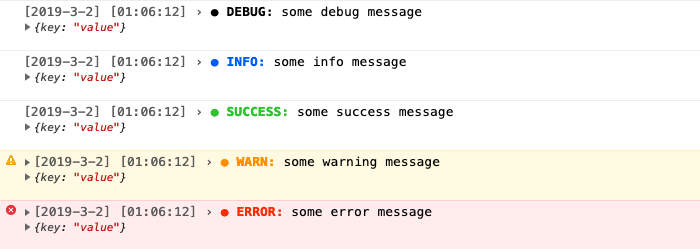
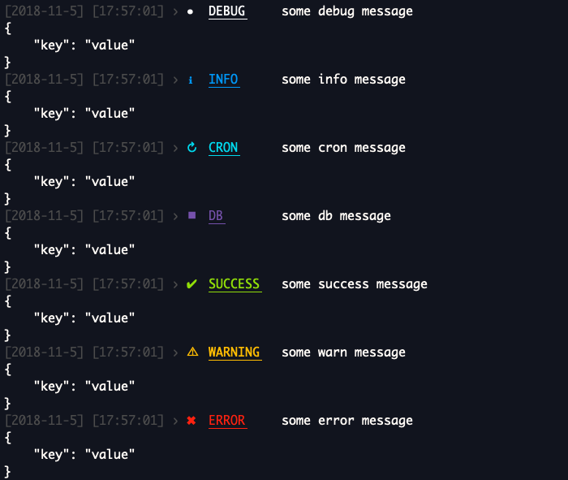

<h1 align="center">
@studiohyperdrive/logger
</h1>
<p align="center">
    <a href="#"></a>
    <a href="#"></a>
    <a href="#"></a>
    <a href="https://opensource.org/licenses/MIT"></a>
</p>
<p align="center">
    <b>One logger to rule them all&nbsp;&nbsp;🚀</b>
    <br>
    <sub>Supports browser console and Node.js, only 3kB, configurable and MIT licensed</sub>
</p>

---

## Table of Contents ##

* [Installation](#installation)
* [Browser](#browser)
  * [Usage](#usage)
  * [Overloads](#overloads)
  * [Configuration](#configuration)
    * [Default configuration](#default-configuration)
* [Node\.js](#nodejs)
  * [Usage](#usage-1)
  * [Overloads](#overloads-1)
  * [Configuration](#configuration-1)
    * [Default configuration](#default-configuration-1)
  * [Slack](#slack)
* [Roadmap](#roadmap)
* [Contributing](#contributing)
* [License](#license)
* [About us](#about-us)

---

**@studiohyperdrive/logger** is a logging library that supports both the browser and Node.js by exporting different bundles for both targets.

## Installation ##

Install through npm:

```shell
$ npm install @studiohyperdrive/logger
```

Install through yarn:

```shell
$ yarn add @studiohyperdrive/logger
```

## Browser ##

For usage with the browser a UMD and ESModule bundle are exported. It provides a `Logger` class which is an abstraction on console.log based on `high-console`.

### Usage ###

Create an instance of the logger and export it for usage in your application:

**logger.js**

```js
import { Logger } from "@studiohyperdrive/logger";

export const logger = new Logger();
```

**app.js**

```js
import { logger } from "./logger";

logger.debug("some debug message", { key: "value" });
logger.info("some info message", { key: "value" });
logger.success("some success message", { key: "value" });
logger.warn("some warn message", { key: "value" });
logger.error("some error message", { key: "value" });
```

**Output**

<p align="center">
    
</p>

### Overloads ###

As documented in the [typings](./typings.ts), each method has several overloads:

```js
logger.info("some info message", { key: "value" }); // Message and object
logger.info("some info message"); // Message
logger.info({ key: "value" }); // Object
logger.info("some info message", { key: "value" }, true); // Force a log when loglevel is disabled
```

### Configuration ###

When creating an instance of the `Logger` class configuration can be provided by passing an options object to the constructor.

```js
import { Logger } from "@studiohyperdrive/logger";

export const logger = new Logger({
    enabled: [
        "error",
    ],
});
```

#### Default configuration ####

The default configuration is the following:

```js
{
    enabled: [ // Enabled loglevels
        "debug",
        "info",
        "success",
        "warn",
        "error"
    ]
}
```

## Node.js ##

For usage with Node.js a CommonJS bundle is exported. It provides a `Logger` class which is an abstraction on console.log based on `signale`.

_Other features_:
- Logging to the filesystem using daily rotating files
    * all
    * warn
    * error
- Sending alerts to Slack for error logs

### Usage ###

Create an instance of the logger and export it for usage in your application:

**logger.js**

```js
const Logger = require("@studiohyperdrive/logger");

const logger = new Logger();

module.exports = logger;
```

**app.js**

```js
const logger = require("./logger");

logger.debug("some debug message", { key: "value" });
logger.info("some info message", { key: "value" });
logger.cron("some cron message", { key: "value" });
logger.db("some db message", { key: "value" });
logger.success("some success message", { key: "value" });
logger.warn("some warn message", { key: "value" });
logger.error("some error message", { key: "value" });
```

**Output**

<p align="center">
    
</p>

### Overloads ###

As documented in the [typings](./typings.ts), each method has several overloads:

```js
logger.info("some info message", { key: "value" }); // Message and object
logger.info("some info message"); // Message
logger.info({ key: "value" }); // Object
logger.info("some info message", { key: "value" }, true); // Force a log when loglevel is disabled
```

### Configuration ###

When creating an instance of the `Logger` class configuration can be provided by passing an options object to the constructor.

```js
const Logger = require("@studiohyperdrive/logger");

const logger = new Logger({
    enabled: [
        "error",
    ],
    filesystem: {
        enabled: true,
        path: "logs",
    },
    slack: {
        enabled: true,
        token: "token",
        app: "my-app",
        channel: "my-channel",
    },
});

module.exports = logger;
```

#### Default configuration ####

The default configuration is the following:

```js
{
    enabled: [ // Enabled loglevels
        "debug",
        "info",
        "cron",
        "db",
        "success",
        "warn",
        "error"
    ],
    filesystem: {
        enabled: true, // Enable logging to filesystem
        path: "logs" // Path for the filesystem logs (from root)
    },
    signale: { // Signale options (https://github.com/klauscfhq/signale#configuration)
        coloredInterpolation: false,
        displayScope: true,
        displayBadge: true,
        displayDate: true,
        displayFilename: false,
        displayLabel: true,
        displayTimestamp: true,
        underlineLabel: true,
        underlineMessage: false,
        underlinePrefix: false,
        underlineSuffix: false,
        uppercaseLabel: true
    },
    slack: {
        app: "", // Name for the current application
        channel: "", // Slack channel to post the messages in (without the #)
        enabled: false, // Enable alerts to Slack for error logs
        token: "" // Slack bot user token
    }
}
```

### Slack ###

## Roadmap ##

We are continuously looking to improve this package. If you have any feedback or ideas, please let us know.

The roadmap as is today:

* Snippets
* Add support for custom, configurable types
* ...

## Contributing

Feel free to provide feedback, open issues or create pull-requests to this repository.

## License ##

**@studiohyperdrive/logger** is [MIT licensed](./LICENSE) by [Studio Hyperdrive](https://www.studiohyperdrive.be/).

## About us ##

[Studio Hyperdrive](https://www.studiohyperdrive.be/) is an experienced digital development studio focussed on all things JavaScript. Already 18 strong. Based in Antwerp & Ghent! With a handpicked set of skills we build anything from websites to chatbots and immersive cross reality experiences. Feel free to contact us through our website.
